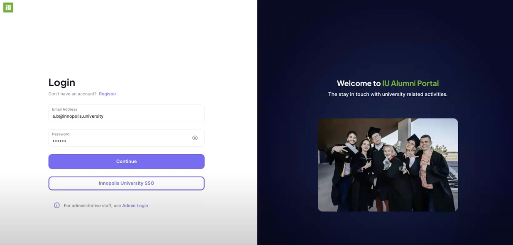
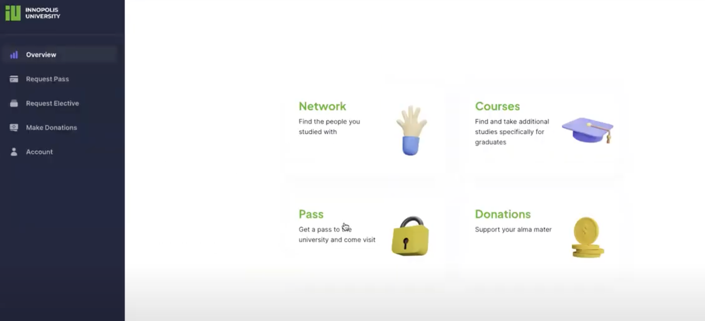
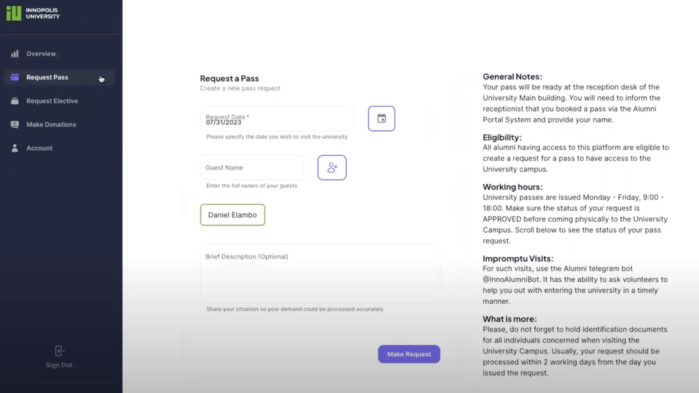
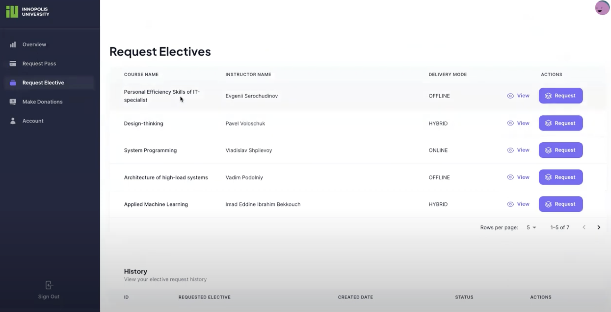
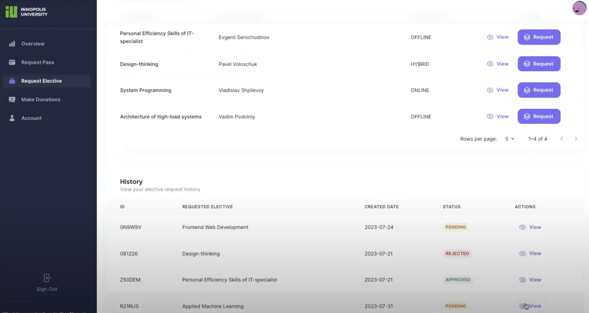
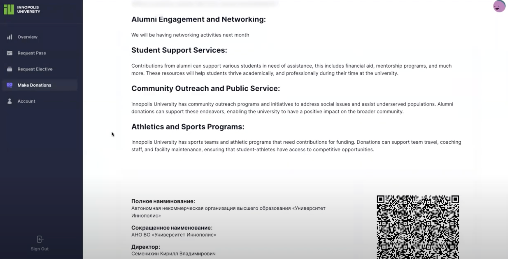
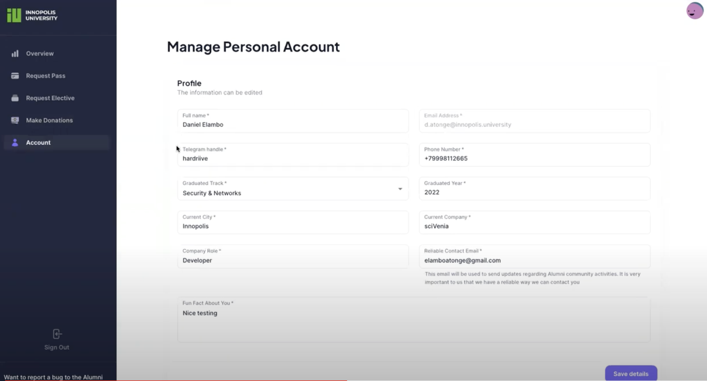
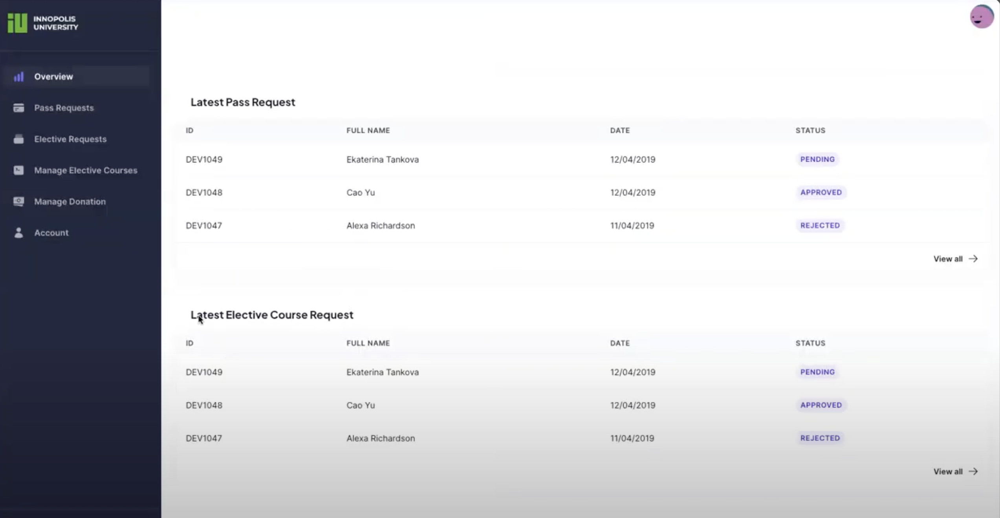

# IU Alumni System Documentation

## Home
Welcome to the IU Alumni System documentation. Here you will find all you need to navigate and utilize the system, whether you are a student, alumnus, university staff, or a developer.

## Overview
The IU Alumni System is a comprehensive platform that enables Innopolis University alumni to stay connected with the university. Through this portal, alumni can register for elective courses, manage event attendance, and request access passes to the university. This interactive system aims to provide a seamless experience for users while maintaining a robust and secure backend for administrators.

## Getting Started
This section guides you through the initial steps to get the IU Alumni System up and running on your local machine.

### Prerequisites
Before you begin, ensure you have the following installed on your system:
- Python 3.8 or higher
- pip (Python package installer)
- Node.js 12 or higher
- npm (Node package manager)
- Docker
- PostgreSQL

These are required to run the backend and frontend of the system as well as for database management.

### Installation Guide
To install the IU Alumni System, you need to set up both the backend and frontend parts of the application.

#### Backend Installation
1. Clone the repository to your local machine.
2. Navigate to the `app` directory in your terminal.
3. Set up a virtual environment using `python -m venv venv`.
4. Activate the virtual environment with `source venv/bin/activate` (on Unix systems) or `venv\Scripts\activate` (on Windows).
5. Install the required packages using `pip install -r requirements.txt`.

#### Frontend Installation
1. Navigate to the `src` directory in your terminal.
2. Install the required Node.js packages using `npm install`.
3. Build the project for production with `npm run build`.

### Initial Configuration
Once the installation is complete, some initial configuration might be necessary:

#### Backend Configuration
1. Ensure that PostgreSQL is running on your system.
2. Create a new database for the application.
3. Configure the database settings in `config.py` to connect to your new database.

#### Frontend Configuration
1. Set up the environment variables required for the frontend application in `next.config.js`.
2. Ensure the backend API is accessible from the frontend application.

Now your IU Alumni System should be ready for use or development purposes.

## User Guide

This section provides guidance on how to use the IU Alumni System. Follow these instructions to navigate through the system and utilize its features.

### 1. Login

To access the IU Alumni System, start at the login page. If you don't have an account, you can register for one. Otherwise, enter your email address and password, then click `Continue`. Alumni can also use the Innopolis University SSO for convenience.

### 2. Home Page with Overview

Once logged in, you're greeted with the home page. This provides an overview of the platform, including quick access to main features such as event updates, course registrations, and pass requests.

### 3. Request Pass

To visit the university, click on `Request Pass`. You'll need to enter the date of your visit and guest names if applicable. Note the general information about pass collection and the eligibility criteria.

### 4. Request Electives

For enrolling in elective courses, go to `Request Elective`. You'll see a list of available courses along with instructor names and delivery modes. Click `Request` on the course you're interested in.

### 5. History of Elective Requests

The system maintains a history of your elective requests. You can review past submissions and their statuses (pending, approved, or rejected) under the history section.

### 6. Make Donations

Contributions are valuable to the university community. Visit the `Make Donations` page to support various university causes and initiatives.

### 7. Manage Personal Account

Your personal account section allows you to update your profile details and contact information. Keep your data up-to-date for better interaction with the alumni community.

### 8. Admin Section (New Login Required)

For administrators, a separate login is required to access the admin panel, where you can manage user requests. The UI is intuitive, with options to approve or decline requests.

For administrative tasks, it's important to securely manage alumni requests, ensuring that actions reflect the current policies and standards of the university.

Please note that the admin section requires a new login, reflecting the need for higher security and administrative privileges.

As this documentation is designed to be clear and helpful, please contact the system administrator if you encounter any issues or have suggestions for improvements.

## Developer Documentation

This section provides detailed information for developers interested in contributing to the IU Alumni System or setting it up for local development.

### System Architecture

The IU Alumni System is structured using a microservices architecture, which separates the frontend and backend services to allow independent scaling and development. The system's architecture is designed to provide a robust, secure, and scalable platform for alumni interactions with the university.

- **Frontend**: Developed using Next.js, it provides an interactive and user-friendly interface.
- **Backend**: Powered by Python's FastAPI framework, it handles business logic, database operations, and server-side rendering.
- **Database**: PostgreSQL is employed for data persistence, chosen for its reliability and feature-rich platform for handling complex data workloads.
- **Containerization**: Docker containers are used to encapsulate the application environment, ensuring consistency across development, testing, and production environments.

### Repository Structure

The repository is organized into multiple directories, each with a specific purpose:

- `/app`: Contains the backend application with FastAPI, including all server logic, API routes, and utilities.
- `/app/templates`: Stores email templates and other HTML templates for communications.
- `/src`: Houses the frontend Next.js application, encompassing all React components, styles, and frontend logic.
- `/public`: A directory for static files such as images, fonts, and client-side JS that needs to be publicly accessible.
- `Dockerfile(s)`: Contains the Docker configuration files for building the application containers.

### Technology Stack

The technology stack was chosen for its performance, scalability, and ease of use:

- **Python FastAPI**: An modern, fast web framework for building APIs with Python 3.7+ based on standard Python type hints. It's chosen for its high performance and ease of development.
- **Next.js**: A React framework that enables functionality such as server-side rendering and generating static websites, which is beneficial for SEO and overall performance.
- **Docker**: Utilized for containerizing the application, Docker provides an isolated environment for development, which is consistent across all stages of deployment.
- **PostgreSQL**: A powerful, open-source object-relational database system that uses and extends the SQL language combined with many features that safely store and scale the most complicated data workloads.

### API Documentation - Donation Management

#### Base URL /donation

Authentication is required for all Donation API endpoints, using bearer tokens in the request header.

#### Endpoints
- **List Donations (`GET /`):** Retrieves all donations associated with the user's account.
- **Create Donation (`POST /`):** Allows the user to submit a new donation with an optional message.
- **Admin Donations (`GET /admin`):** Fetches the latest 'ADMIN' type donation message.
- **Update Admin Message (`POST /admin`):** Updates or creates an 'ADMIN' type donation message.

#### Responses
Responses will include status codes such as `200 OK` for successful requests, `201 Created` for successful creation, and `202 Accepted` for successful updates.

### API Documentation - Elective Courses

#### Base URL /elective_course

Authentication with bearer tokens is also required for Elective Courses API endpoints.

#### Endpoints
- **List Courses (`GET /`):** Retrieves a list of all available elective courses.
- **Booked Courses (`GET /booked`):** Fetches elective courses that the user has booked.
- **Course Requests (`GET /request`):** Lists all elective course requests.
- **Create Course (`POST /`):** Endpoint to create a new elective course.
- **Bulk Create (`POST /bulk`):** Allows for the creation of multiple elective courses at once.
- **Update Course (`PUT /`):** Updates details of an existing elective course.
- **Delete Course (`DELETE /remove`):** Removes an elective course from the system.
- **Course Request (`POST /request`):** Allows a user to request to join an elective course.

### API Documentation - Pass Requests

#### Base URL /request_pass

All pass request endpoints mandate authenticated access.

#### Endpoints
- **List Passes (`GET /`):** Fetches all pass requests made by the user.
- **Admin Passes (`GET /admin`):** Lists all pass requests accessible by admins.
- **Update Request (`PATCH /`):** Allows for updating the status of an existing pass request.
- **Order Pass (`POST /`):** Creates a new request for a pass.
- **Disconnect Request (`DELETE /`):** Removes a pass request.

Responses will be structured in JSON, including appropriate HTTP status codes to indicate the outcome of the request.

#### Error Handling
Standard HTTP status codes are used to indicate errors:
- `401 Unauthorized`: Authentication required or token invalid.
- `404 Not Found`: Resource not available.
- `422 Unprocessable Entity`: Issues with request data.
- `500 Internal Server Error`: General server-side error.

For contributions, refer to our contribution guidelines and ensure you test your changes thoroughly before submitting a pull request.

